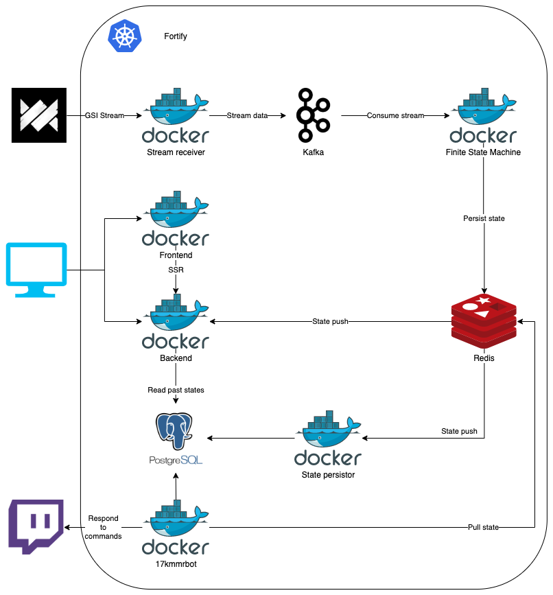

# Fortify

## Overview

This project aims to develop a platform, that is aggregating and processing game state integration logs in order to extract live information from matches and collect stats from played matches.

## Architecture

## Getting started

### Local Setup

All necessary databases and systems can be started using `docker-compose up -d`.

The corresponding microservices are located in the `services/` directory.
Those can be started locally by navigating into the service's directory and running `npm run dev`. (Each microservice will have a dedicated Readme explaining necessary setup steps.)

### Kubernetes Setup

TODO: Write Kubernetes setup guide

## Resources

- [Valve: Game State Integration for CS:GO](https://developer.valvesoftware.com/wiki/Counter-Strike:_Global_Offensive_Game_State_Integration)
- [Game State Integration: A Very Large and In-Depth Explanation [CS GO]](https://www.reddit.com/r/GlobalOffensive/comments/cjhcpy/game_state_integration_a_very_large_and_indepth/)
- Join us on Discord ([https://discord.gg/u9qJxzQ](https://discord.gg/u9qJxzQ))

## Disclaimer

Fortify (© 2020 Thomas Kosiewski) is a community project and is not affiliated with Valve or Steam.

Dota Underlords is a registered trademark of Valve Corporation.
