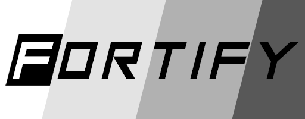

# Fortify



## Overview

This project is a big data processing platform, that is aggregating and processing Dota Underlord's game state integration logs in order to extract live information from matches and collect stats from played matches.

## Getting started

### Local Setup

All necessary containers to for a development environment can be pulled & started using `docker-compose up -d`.

### Starting already build images

All fortify docker images (that are running in production) can also be downloaded locally.

This can be done, using the following commands:

- Pulling all images

  ```bash
  source ./scripts/versions.sh
  docker-compose -f build.docker-compose.yml pull
  ```

- Pulling a specific image

  ```bash
  source ./scripts/versions.sh
  docker-compose -f build.docker-compose.yml pull <service name>
  ```

## Services

Fortify contains of many smaller services, that each have their own documentation.

- [17kmmrbot](services/17kmmrbot/)
- [backend](services/backend/)
- [frontend](services/frontend/)
- [fsm](services/fsm/)
- [gsi-receiver](services/gsi-receiver/)
- [historization](services/historization/)
- [jobs](services/jobs/)
- [sentry-discord-webhook](services/sentry-discord-webhook/)

And shared libraries:

- [shared](services/shared/)

## Production deployment

[See Terraform docs](./docs/terraform.md)

[See Kubernetes docs](./docs/kubernetes.md)

[See Vault docs](./docs/vault.md)

## Implementation details

[GSI parsing finite state machine](./docs/fsm.md)

[Fortify internal events](./docs/events.md)

## Resources

- [Valve: Game State Integration for CS:GO](https://developer.valvesoftware.com/wiki/Counter-Strike:_Global_Offensive_Game_State_Integration)
- [Game State Integration: A Very Large and In-Depth Explanation [CS GO]](https://www.reddit.com/r/GlobalOffensive/comments/cjhcpy/game_state_integration_a_very_large_and_indepth/)
- Join us on Discord ([https://discord.gg/u9qJxzQ](https://discord.gg/u9qJxzQ))

## Disclaimer

Fortify (© 2021 Thomas Kosiewski) is a community project and is not affiliated with Valve or Steam or Twitch.

Valve, the Valve logo, Steam, the Steam logo, Source, the Source logo, Dota, the Dota 2 logo, Defense of the Ancients, Dota Underlords and the Dota Underlords logo are trademarks and/or registered trademarks of Valve Corporation.

TWITCH, the TWITCH Logo, the Glitch Logo, and/or TWITCHTV are trademarks of Twitch Interactive, Inc. or its affiliates.

The Fortify logo and Fortify banner are intellectual property of John "johnxfire" Nathan Fernandez.
