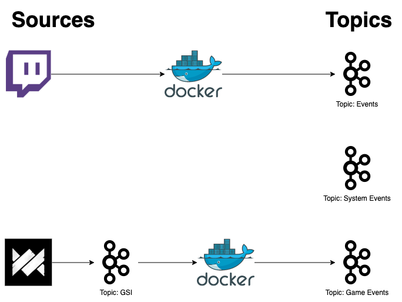

# Events

## Introduction

The idea behind an event driven architecture is to have generic events and event topics, serving as a common interface informing about things happening in the system.

The following diagram is a simple explanation of the architecture behind.

Generic topics will contains messages produced and / or extracted from different sources, enabling each micro service to consume the topic necessary for them.

The decoupling of direct microservice command to generic events enables a decoupled system architecture and enables services to be plugged on and off at any time.

## Topics

### Events Topic

The events topic will contain external events such as for instance "twitch streamer went live".

### System Events Topic

The systems events topic will contains events, such as a user linking a twitch account or comparable events happening inside of the system.
Basically events that were generated internally.

### Game Events Topic

The game events topic will contain events that happened in game: e.g. the FSM service detected that a match has finished or a person got eliminated as nth player.
