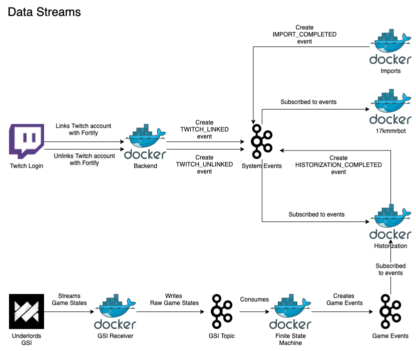

# Events

Fortify is designed with an event driven architecture in mind.

This means that events can be generated from any service at any time and can be processed by any service subscribing to them at any time with variable delays and lags.

Kafka is being utilized as message queue, serving as a common interface for all services & languages, enabling the decoupling of services and offering flexibility for future implementations.

## Event Types

In total there are 3 different type of events:

- [Game](#Game-Events)
- [Generic](#Generic-Events)
- [System](#System-Events)

Each event type is written to its corresponding Kafka topic, which in turn has custom retention rules.

All events have a `type` and a `timestamp`, with `timestamp` allowing delayed event processing in case of failures, unforeseen burst loads or batch processing.

The following is a rough chart of data streams inside of Fortify:

## Game Events

- `MATCH_STARTED`: Event created when a new match is detected (FSM generated event)
- `FINAL_PLACE`: Event created when a player got eliminated with a final placing (FSM generated event)
- `MATCH_ENDED`: Event created when a match has concluded with a first place winner (FSM generated event)
- `RANK_TIER_UPDATE`: Event created when a match starts, includes a players current rank tier (FSM generated event)
- `SMURF_DETECTED`: Event created when a smurf account has been detected (FSM generated event)
- `UNIT_STATS`: Event created after each combat, tracking unit win/loss in conjunction with active alliances and equipped item (FSM generated event)
- `ITEM_STATS`: Event created after each combat, tracking item win/loss in conjunction with active alliances (FSM generated event)
- `ALLIANCE_STATS`: Event created after each combat, tracking alliance win/loss in conjunction with active alliances (FSM generated event)
- `COMBINED_STATS`: Event combining all 3 stats event for easier batch processing for time series / wide column databases (FSM generated event)

## Generic Events

Currently unused

## System Events

- `FSM_RESET_REQUEST`: RPC event used to reset the finite state machines user state. (Twitch bot / manually generated event)
- `TWITCH_LINKED`: Event created when a Twitch account has been linked with Fortify (backend generated event)
- `TWITCH_UNLINKED`: Event created when a Twitch account has been unlinked with Fortify (backend generated event)
- `TWITCH_MESSAGE_BROADCAST`: Event used to broadcast a message to all twitch channels the bot is currently joined in (manually generated event)
- `IMPORT_COMPLETED`: Event announcing a successful import of the Underlords leaderboard (import jobs generated event)
- `HISTORIZATION_COMPLETED`: Event announcing successful storing individual ranks of the imported leaderboard (historization generated event)
