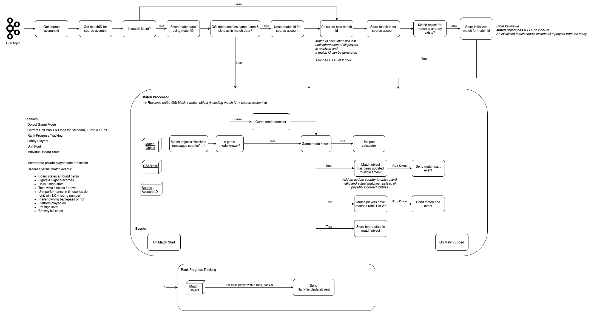

# Finite State Machine

Fortify's finite state machine is the heart of the entire operation, successfully processing millions of GSI messages per month.

Initially, the finite state machine was hastily written together and started to show it's shortcomings. These shortcomings included slow processing under load and incorrectly detected game modes, rendering any future use for stats collection impossible.

This lead to a complete redesign & rewrite from scratch, with many new features and fixes baked into it.

A rough, high-level view of the finite state machine can be seen bellow:

## Features

- Detect Game Modes
- Correct unit pool sizes & odds for each game mode
- Game state tracking
- Rough round number estimations
- Rank progression tracking
- Player lobby processing
- Consolidated unit pool
- Individual board states
- Processing of private player states
- Smurf detection
- Unit / Item / Alliance (or to be technically correct: Synergy) performance tracking

## Consolidated match states

With multiple player potentially being in the same match, it's not only wasteful to keep separate match states for each player, but information might also get lost, if the transmitted of one player's GSI information has gotten lost. This might lead to incorrect calculations and stats tracking.

In order to prevent this from happening, all players from one match are all sourced together into one combined match state.

This is introducing a new data inconsistency scenario. As in one player's GSI data is sent with a major lag compared to other players, thus overriding newer data with old data.

In order to avoid this scenarios of potential race conditions and data inconsistencies, the finite state machine is only performing updates on each public and private player state individually, if the `sequence_number` is higher than the previously stored `sequence_number`.

## Shortcomings

Two minor shortcomings of the above finite state machine can be broken down into missing information and information having to be guessed / estimated.

### Unknown match ID

GSI is not forwarding any information about the actual match itself (unlike it's counterpart in Dota and CS GO).

In order to still be able to track matches, the finite state machine is creating it's own match ID based of player account IDs and their slots inside of the lobby, which is then piped into a hash function.

In case of "collisions" (generated match ID has already been used and the original match identified by said ID already has player slots with a final_place set), the above match id generation will have a nonce appended, which will gradually increase until a match ID has been generated, that has not been used before.

### Unknown round number

Like with the unknown match ID, round numbers are also not present in GSI data.

This unknown variable can be guesstimated by taking the Underlords levels into consideration, as Underlord levels are tied to round numbers & game modes.

## Happy Little Accidents

When designing the new version of the finite state machine, I have not considered handling the duos game mode.

Thus the finite state machine was originally designed to primarily work with 8 player lobbies, yet this number has not been capped anywhere in the final implementation.

For some reason, the finite state machine managed to correctly detect duos lobby and wait for all 16 players public player states.

So technically a desired feature, that was not planed at all and manifested itself as a bug. So quite literally a bug turning into a feature. (Probably one of my best & proudest bugs.)
