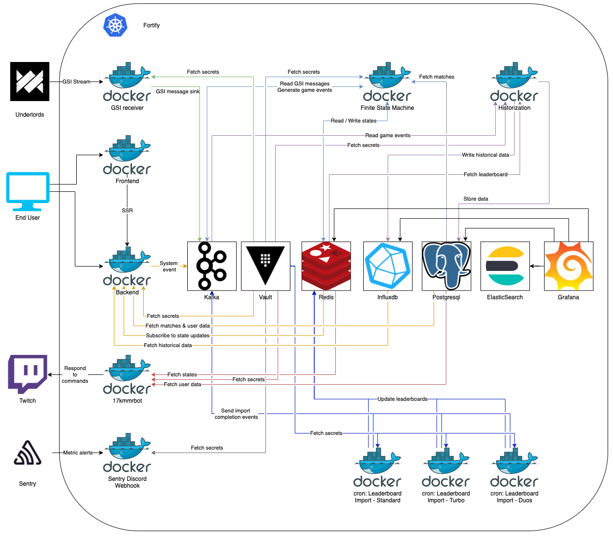

# Kubernetes

At the time of writing, Fortify is running on Kubernetes version 1.20.4.

The philosophy behind the cluster's architecture and operations are aimed towards high availability, general system stability and horizontal scalability.

## Architecture

## System Components

Most components are deployed using either operators or helm charts:

- Kafka / ZooKeeper: [Strimzi](https://strimzi.io/)
- Postgres: [Zalando's Postgres Operator](https://github.com/zalando/postgres-operator)
- ElasticSearch: [Elastic Cloud on Kubernetes](https://www.elastic.co/guide/en/cloud-on-k8s/current/index.html)
- Redis: [Spotahome's Redis Operator](https://github.com/spotahome/redis-operator)
- Vault: [Hashicorp's helm chart](https://github.com/hashicorp/vault-helm)
- Traefik: [Traefik's helm chart](https://github.com/traefik/traefik-helm-chart)
- Prometheus: [Prometheus's helm chart](https://github.com/prometheus-community/helm-charts)
- Grafana: [Grafana's helm chart](https://github.com/grafana/helm-charts)

## Manifests

All Kubernetes manifests and helm values.yaml files are dynamically synthesized at either build time in CI/CD pipelines or locally.

The manifest synthesization has been implemented using AWS's [cdk8s](https://cdk8s.io/) and Fortify's cdk8s projects for this lies in `devops/kubernetes`.

The main advantage of synthesizing manifest is having kubernetes manifests as code, comparable to Terraform's infrastructure as code.

This results in better reusability, unification of common definitions, and tighter integrations into the Fortify codebase itself.

Thanks to this, it's unnecessary to edit any kubernetes manifests in order to increase version numbers in the case of Fortify. The corresponding version numbers for each service will be derived from the service's `package.json` file.

## Setup steps

Navigate to `devops/kubernetes`.

- Duplicate the `.env.example`.

  Rename the newly created file to `.env` and fill in the missing values.

- Install dependencies using: `npm install`

- Build the manifests using `npm run build`

  (Building all manifests (including helm values.yaml files), prior to running the above command set the `"CLUSTER_SETUP"` environment variable to `"1"`.)

- Install all system components.

  Initialize and unseal the Vault.
  Store application secrets in the corresponding paths & secrets.

  See [vault docs](vault.md) for a more detailed documentation on those steps.

- Apply all kubernetes manifests using `kubectl apply -f dist/<name>.yaml`
